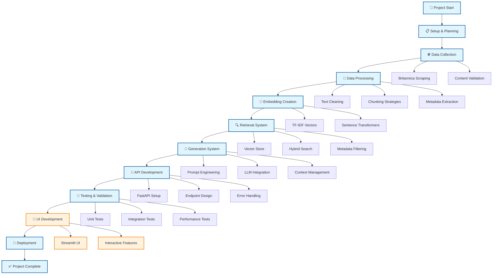
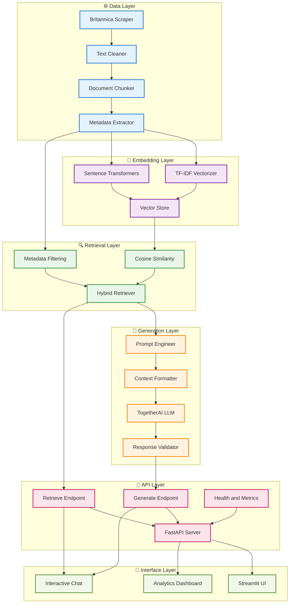
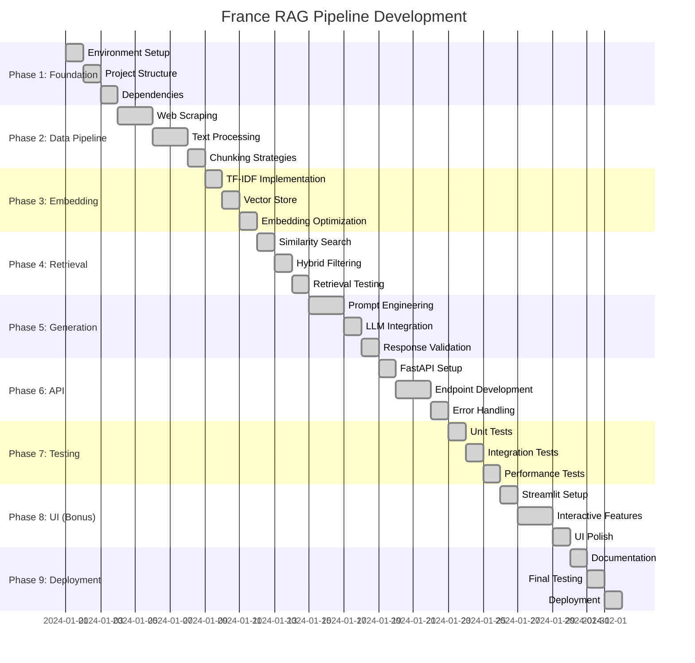
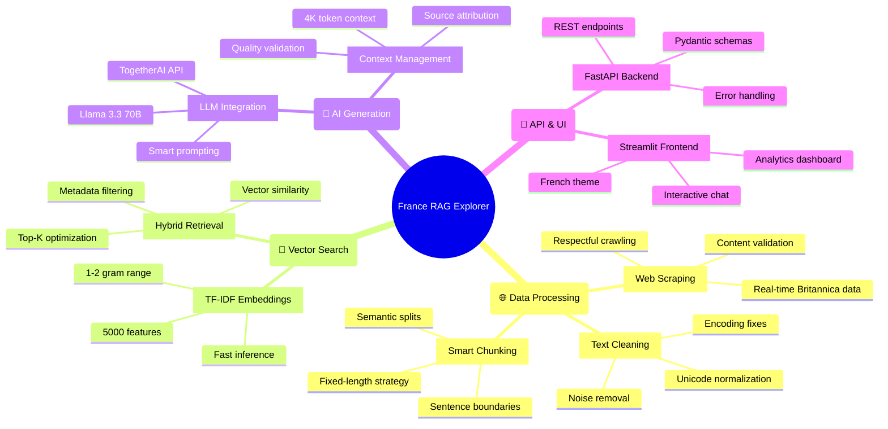
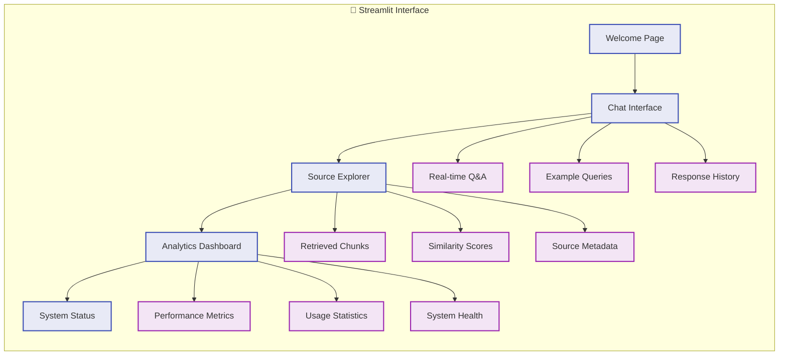

# 🇫🇷 France RAG Explorer

**Retrieval-Augmented Generation Pipeline for French Geography**

A complete end-to-end RAG system that scrapes Britannica's France geography content, creates vector embeddings, and provides intelligent Q&A capabilities through a FastAPI backend and beautiful Streamlit UI.


## 🎯 Project Overview

This project implements a sophisticated RAG pipeline that:
- Scrapes and processes geographical data about France from Britannica
- Creates vector embeddings using TF-IDF or sentence transformers
- Provides hybrid retrieval combining vector similarity and metadata filtering
- Generates contextual answers using TogetherAI's LLM models
- Exposes clean REST API endpoints
- Includes a Streamlit UI for interactive exploration

## 🗺️ Project Roadmap



## 🏗️ System Architecture



## 📊 Development Timeline



## 🚀 Quick Start

### Prerequisites

- Python 3.8+
- TogetherAI API key ([Get one here](https://api.together.xyz/settings/api-keys))

### 1. Environment Setup

```bash
# Clone the repository
git clone https://github.com/SheidaAbedpour/RAG-Pipeline
cd france-rag-explorer

# Install dependencies
pip install -r requirements.txt

# Set up environment variables
export TOGETHER_API_KEY="your_api_key_here"
# Or create a .env file:
echo "TOGETHER_API_KEY=your_api_key_here" > .env
```

### 2. Complete Setup (Recommended)

Run the automated setup script that handles everything:

```bash
python setup_system.py
```

This will:
- ✅ Check prerequisites
- ✅ Install dependencies
- ✅ Scrape and process Britannica data
- ✅ Create vector embeddings
- ✅ Test the system
- ✅ Provide usage instructions

### 3. Manual Setup (Alternative)

If you prefer step-by-step setup:

```bash
# Step 1: Process data
python scripts/data_preprocessing.py

# Step 2: Create embeddings
python scripts/create_embeddings.py

# Step 3: Test system
python test_system.py
```

### 4. Start the System

```bash
# Option A: Run complete app (API + UI)
python run_app.py

# Option B: API only
python scripts/run_api.py

# Option C: Full setup + UI
python scripts/setup_and_run_app.py
```

## 📡 API Endpoints

### Health Check
```bash
GET /health
```

### Retrieve Sources
```bash
POST /retrieve
Content-Type: application/json

{
  "query": "What are the main mountain ranges in France?",
  "k": 5,
  "section_filter": "Land",
  "min_score": 0.0
}
```

### Generate Answer
```bash
POST /generate
Content-Type: application/json

{
  "query": "Describe the climate of France",
  "k": 5,
  "temperature": 0.3,
  "max_tokens": 512
}
```

### Example Usage

```bash
# Test the API
curl http://localhost:8000/health

# Get sources
curl -X POST "http://localhost:8000/retrieve" \
  -H "Content-Type: application/json" \
  -d '{"query": "French mountains", "k": 3}'

# Generate answer
curl -X POST "http://localhost:8000/generate" \
  -H "Content-Type: application/json" \
  -d '{"query": "What are the main geographical features of France?"}'
```

## 🎯 Key Features & Capabilities



## 🧱 System Components

### 1. Data Processing 

**Text Cleaning** (`src/data/text_cleaner.py`):
- Unicode normalization (NFKD)
- Whitespace normalization
- Special character handling
- Encoding issue fixes
- Punctuation cleanup

**Document Chunking** (`src/data/document_chunker.py`):
- **Fixed-length**: 512 tokens with 50-token overlap
- **Sentence-based**: Semantic boundaries with overlap
- **Semantic**: Paragraph-based natural splits
- Configurable parameters for optimization

**Metadata Extraction**:
- Section/subsection hierarchies
- Source URLs and domains
- Content type classifications
- Chunk size and overlap tracking

### 2. Retrieval Strategy 

**Vector Embeddings** (`src/embedding.py`):
- **TF-IDF**: 5000 features, 1-2 gram range, English stopwords
- **Sentence Transformers**: all-MiniLM-L6-v2 (384 dimensions)
- Trade-off: TF-IDF for speed, transformers for semantic quality

**Hybrid Retrieval** (`src/retrieval/hybrid_retriever.py`):
- Cosine similarity vector search
- Metadata filtering by section/subsection
- Score thresholding
- Configurable top-K results

**Retrieval Optimization**:
- 3x initial retrieval pool for filtering
- Section-aware result ranking
- Content statistics and availability checks

### 3. Generation Strategy 

**LLM Integration** (`src/generation.py`):
- **Model**: meta-llama/Llama-3.3-70B-Instruct-Turbo-Free
- **Temperature**: 0.3 (balanced creativity/consistency)
- **Max tokens**: 1024 (comprehensive answers)
- **Context length**: 4000 tokens with smart truncation

**Prompt Engineering**:
```python
system_prompt = """You are a knowledgeable assistant specializing in French geography and culture. 
You provide accurate, informative responses based on the given context.

Key guidelines:
- Use only the information provided in the context
- Be specific and detailed in your responses
- If information is not available in the context, clearly state this
- Cite sections when possible (e.g., "According to the Land section...")
- Maintain a professional, educational tone"""
```

**Context Management**:
- Hierarchical chunk formatting with section headers
- Source attribution and chunk IDs
- Smart truncation with context preservation
- Quality validation and improvement suggestions

### 4. FastAPI Integration 

**Clean Architecture** (`main.py`):
- Pydantic schemas for request/response validation
- Dependency injection for RAG components
- Comprehensive error handling
- CORS support for web interfaces
- Request metrics and monitoring

**Modular Structure**:
```
src/
├── data/           # Scraping, cleaning, chunking
├── embedding.py    # Vector embeddings
├── retrieval/      # Vector store, hybrid search
├── generation.py   # LLM integration, prompts
├── schemas.py      # API schemas
└── main.py         # FastAPI application
```


### Streamlit UI - Interactive Experience



**Features**:
- **Interactive Chat**: Real-time Q&A with the system
- **Source Explorer**: View retrieved chunks and scores
- **System Analytics**: Performance metrics and statistics
- **French Theme**: Beautiful flag-inspired design
- **Example Queries**: Pre-built geography questions

Access at: `http://localhost:8501`

### Advanced System Features


## 📊 Performance & Evaluation

### Sample Outputs

**Query**: "What are the main mountain ranges in France?"

**Retrieved Sources**:
1. **The younger mountains** (score: 0.847)
   - "The Alps and Pyrenees form France's primary mountain barriers..."
2. **Land** (score: 0.732)
   - "France's topography includes ancient massifs and younger mountain chains..."

**Generated Answer**:
> According to the Land section, France's main mountain ranges include the Alps and Pyrenees, which form the country's primary mountain barriers. The Alps section indicates these are part of the younger mountain systems that shape France's southeastern and southwestern borders respectively. The Pyrenees create a natural boundary with Spain, while the Alps extend along the borders with Italy and Switzerland.

### Evaluation Metrics
- **Retrieval Precision**: Relevant chunks in top-K results
- **Answer Faithfulness**: No hallucinations, source-grounded responses
- **Coverage**: Comprehensive use of retrieved context
- **Consistency**: Stable output format and quality
- **Robustness**: Graceful error handling

## 🔧 Configuration

Key settings in `config/config.py`:

```python
# Embedding Configuration
EMBEDDING_TYPE = "tfidf"  # or "sentence-transformers"
MAX_FEATURES = 5000
NGRAM_RANGE = (1, 2)

# Generation Configuration
MODEL_NAME = "meta-llama/Llama-3.3-70B-Instruct-Turbo-Free"
TEMPERATURE = 0.3
MAX_TOKENS = 1024

# Retrieval Configuration
DEFAULT_K = 5
MIN_SCORE = 0.0
MAX_CONTEXT_LENGTH = 4000
```

## 🧪 Testing

Run the comprehensive test suite:

```bash
# Complete system test
python test_system.py

# Individual component tests
python scripts/data_preprocessing.py --test-mode
python -m pytest tests/ -v
```

Tests cover:
- Data processing pipeline
- Embedding generation
- Retrieval accuracy
- Generation quality
- API endpoint functionality
- Error handling

## 📁 Project Structure

```
france-rag-explorer/
├── config/
│   └── config.py              # Configuration management
├── src/
│   ├── data/
│   │   ├── britannica_scraper.py    # Web scraping
│   │   ├── text_cleaner.py          # Text preprocessing
│   │   ├── document_chunker.py      # Chunking strategies
│   │   └── data_processor.py        # Pipeline orchestration
│   ├── retrieval/
│   │   ├── vector_store.py          # Vector storage
│   │   └── hybrid_retriever.py      # Hybrid search
│   ├── embedding.py           # Embedding models
│   ├── generation.py          # LLM integration
│   └── schemas.py            # API schemas
├── scripts/
│   ├── data_preprocessing.py  # Data pipeline script
│   ├── create_embeddings.py   # Embedding creation
│   ├── run_api.py            # API server
│   └── setup_and_run_app.py  # Complete setup
├── frontend/
│   └── france_rag_ui.py      # Streamlit interface
├── data/                     # Generated data
├── main.py                   # FastAPI application
├── run_app.py               # Main launcher
├── test_system.py           # System tests
├── setup_system.py          # Automated setup
├── requirements.txt         # Dependencies
└── README.md               # This file
```

## 🔍 Design Decisions & Rationale

```mermaid
graph TD
    subgraph "🧩 Chunking Strategy Decision Tree"
        A[Document Input] --> B{Content Type?}
        B -->|Structured| C[Semantic Chunking]
        B -->|Mixed Content| D[Sentence-based]
        B -->|Uniform Text| E[Fixed-length]
        
        E --> E1[✅ 512 tokens<br/>50 overlap]
        E1 --> E2[Rationale:<br/>• Balanced context size<br/>• Prevents info loss<br/>• Fair similarity comparison]
    end
    
    subgraph "🧮 Embedding Model Comparison"
        F[Model Selection] --> G{Priority?}
        G -->|Speed| H[TF-IDF]
        G -->|Quality| I[Sentence Transformers]
        G -->|Balance| J[Hybrid Approach]
        
        H --> H1[✅ Primary Choice<br/>5000 features<br/>1-2 grams]
        H1 --> H2[Benefits:<br/>• Fast inference<br/>• No dependencies<br/>• Good keyword matching]
        
        I --> I1[🔄 Optional<br/>all-MiniLM-L6-v2<br/>384 dimensions]
        I1 --> I2[Benefits:<br/>• Semantic understanding<br/>• Better context<br/>• Higher accuracy]
    end
    
    subgraph "🔍 Retrieval Architecture"
        K[Search Query] --> L[Vector Similarity]
        K --> M[Metadata Filtering]
        L --> N[Combined Scoring]
        M --> N
        N --> O[✅ Top-K Results]
        
        O --> O1[Advantages:<br/>• Semantic + keyword<br/>• Topic filtering<br/>• Configurable precision]
    end
    
    subgraph "🤖 Generation Strategy"
        P[Context + Query] --> Q[Prompt Engineering]
        Q --> R[LLM Processing]
        R --> S[Response Validation]
        
        Q --> Q1[✅ Structured Prompt<br/>System instructions<br/>Context injection]
        Q1 --> Q2[Design:<br/>• Clear guidelines<br/>• Source attribution<br/>• Professional tone]
        
        R --> R1[✅ Llama 3.3 70B<br/>Temperature: 0.3<br/>Max tokens: 1024]
        R1 --> R2[Parameters:<br/>• Balanced creativity<br/>• Comprehensive answers<br/>• Consistent quality]
    end
    
    classDef decision fill:#e1f5fe,stroke:#01579b,stroke-width:2px
    classDef choice fill:#e8f5e8,stroke:#2e7d32,stroke-width:2px
    classDef rationale fill:#fff3e0,stroke:#f57c00,stroke-width:2px
    
    class A,B,F,G,K,P decision
    class E1,H1,I1,O,Q1,R1 choice
    class E2,H2,I2,O1,Q2,R2 rationale
```



## 📄 License

This project is created for educational purposes as part of an Data Mining course final project.

## 🤝 Contributing

This is an academic project, but feedback and suggestions are welcome!

---

**Built with ❤️ for French Geography Education**

*Explore the diverse landscapes and rich geographical heritage of France through intelligent AI-powered conversations.*
